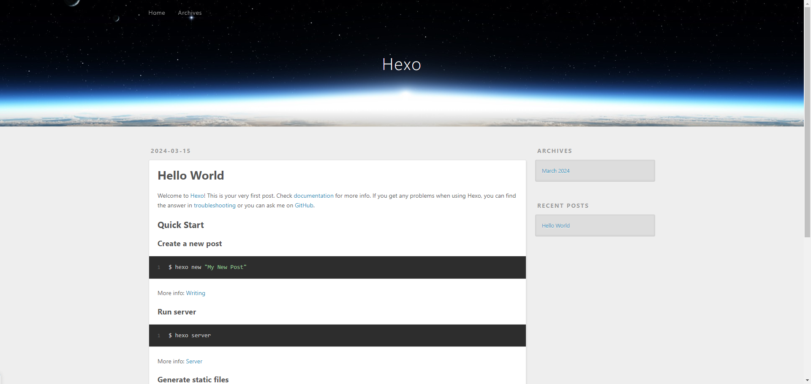
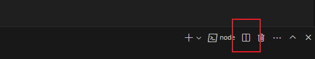
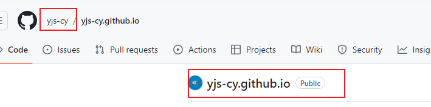
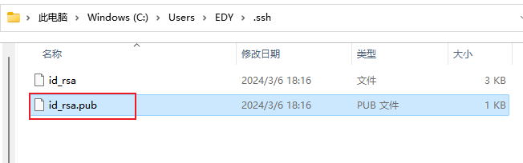
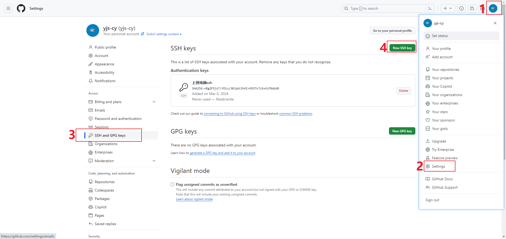
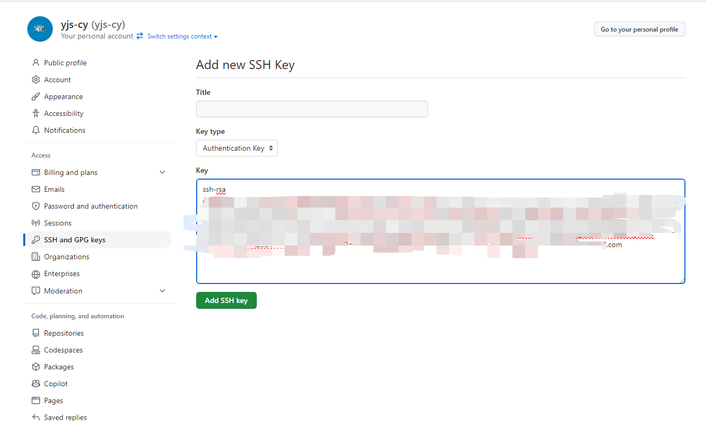
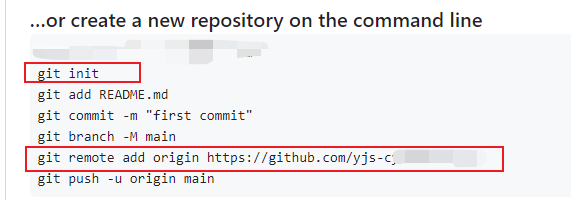

>这里默认你的电脑已经配置好了开发环境。如果没有等我写完对应的文章哈，到时会在这里添加链接。

# hexo博客搭建
## 安装hexo
```
//下载
npm install -g hexo-cli
//查看版本
hexo -v
```
## 初始化博客
### 已有文件夹
将文件夹拖入VS code中执行下方命令
```
//初始化
hexo init
//安装依赖
npm i
//启动博客
hexo s
```
### 无文件夹
直接打开想要将博客存放的位置右键打开自带终端执行一下命令
```
//初始化，name替换成自己博客的名字
hexo init name
//进入博客
cd name
//安装依赖
npm i
//启动博客
hexo s
```
两种方式都可以得到一个地址 http://localhost:4000/ 打开浏览器试运行吧！！！

你能看到如下图所示证明你的博客已经搭好了，下面就该发布代码啦。


# 发布到github
对了，如果你和我一样用的VS code那么你就不用关闭项目了，直接在下方终端的右上角找一个书的按钮点击会分出一个终端，我们接下来的命令就可以在这里执行了。

## 部署我们的博客
第一步：去github上注册一个账号并创建一个名为username.github.io的项目。如下图我的账号名字就叫yjs-cy

第二步：生成SSH添加到GitHub
```
//全局配置
git config --global user.name "yourname"
git config --global user.email "youremail"
完成后创建SSH,一路回车就行
ssh-keygen -t rsa -C "youremail"
```
好的我们SSH已经生成,复制对应文件的所有内容

而后进入github点击右上角头像再点setting，找到 **SSH keys** 的设置选项，点击 **New SSH key** 把你复制的内容粘贴进去如下图


第三步：回到项目执行命令
```
//初始化git
git init
//在github刚才成功的页面可以获取到下方命令
git remote add origin <远程仓库地址>
```

第四步：部署博客
先去下载一个依赖
```
npm install hexo-deployer-git --save
```
修改Hexo根目录下 **_config.yml** 文件中 **deploy** 的相关属性
```
deploy:
  type: git
  repo: <远程仓库地址>
  //branch:指的是远程仓库的某一个分支，我创建的默认分支是main所以就写这个了你们按自己的来
  branch: main
```
好了，重头戏要开始了。执行以下命令让我们真正开始部署吧
```
npm run deploy
```
完成之后就可以打开站点查看了这是我的博客地址欢迎参观。[https://yjs-cy.github.io/](https://yjs-cy.github.io/)。
自己的站点就是把 https://yourname.github.io 中的yourname替换成你的github名字
## 源代码发布
上面我们只是部署了我们自己的静态网页但是源码还在当前电脑上，如果我们换了一台电脑可咋整呀。解决办法来了
第一步：本地保存
```
//四个命令依次执行，新分支名就自己想喽
git add .
git commit -m 'feat:blog init'
git checkout -b 新分支名
git push --set-upstream origin 新分支名
```
之后，换电脑就将代码拉下来，重新生成SSH，重新下载依赖就好。
基础博客就这样了，后面我们慢慢优化。
欢迎留下你们的博客地址，后期有友链功能后也可以互相添加友链哟！！！！！